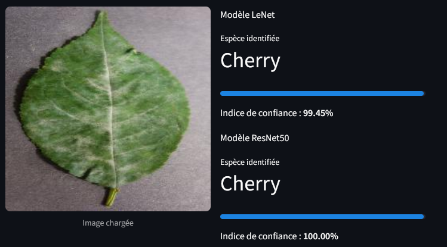
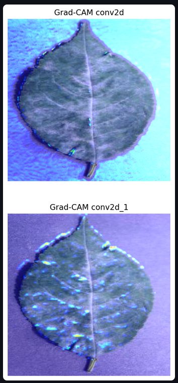

# :herb: Reconnaissance d'espèces végétales :herb:
## Description générale
Ce projet vise à développer un modèle de deep learning capable d’identifier automatiquement l’espèce végétale présente dans une image.
Il s’appuie sur plus de 58 000 images issues de Kaggle et couvre 26 espèces végétales.

Ce projet est réalisé dans le cadre de ma formation de Data Scientist avec la structure Liora.

## :bar_chart: Jeu de données :bar_chart:
Les données proviennent de :
- https://www.kaggle.com/vbookshelf/v2-plant-seedlings-dataset
- https://www.kaggle.com/abdallahalidev/plantvillage-dataset
*Le jeu de donnée n'est pas inclus dans le repository et doit être ajoutée dans le dossier '02_data/data_brute'*

Le dataset contient :
- 26 classes
- Environ 58 000 images
- Un déséquilibre significatif entre certaines espèces

## :brain: Méthodologie :brain:
- Analyse descriptive des données brutes
    → [01_Scripts/01_data_exploration.py](01_Scripts/01_data_exploration.py)
- Prétraitement des données 
    → [01_Scripts/hash_and_search.py](01_Scripts/hash_and_search.py)
    → [01_Scripts/02_data_pretreatment.py](01_Scripts/02_data_pretreatment.py)
- Modélisation
    → [01_Scripts/03_modelisation.py](01_Scripts/03_modelisation.py)
- Présentation par streamlit
    → [01_Scripts/04_streamlit.py](01_Scripts/04_streamlit.py)
    → [01_Scripts/streamlit/](01_Scripts/streamlit/)

Deux modèles de reconnaissance ont été crées. L'un est un modèle entrainé entièrement à partir du jeu de donnée, tandis que l'autre est issue du *Transfer Learning* de ResNet. Par soucis d'espace de stockage, aucun modèle n'est présent dans [03_model/](03_model/).

## Résultats
- Les deux modèles obtiennent de bons (F1-score) pour classer les plantes et l'accuracy générale est supérieure à 95 % ;
- Ils utilisent principalement les contours des feuilles et les nervures pour la classification MAIS parfois le fond des images également ;
- Les deux modèles ont du mal à classer avec une grande précision deux espèces de plantes adventices ("Black grass" et  "Loose Silky-bent")
- Le modèle issue de ResNet50 est plus performant avec une accuracy de 99%. 

**Pistes d'amélioration** :
- Augmenter la taille du jeu de données (notamment pour les plantes adventices) ;
- Segmenter les images pour éviter l'apprentissage du fond des images.


## Installation
Clone the repository and install dependencies:
```bash
git clone https://github.com/rcanet/projet_plantes.git
cd projet_plantes
pip install -r requirements.txt
```

## Exemple d'utilisation
Visualisez ici les performances de nos modèles en conditions réelles. L'analyse Grad-CAM permet de confirmer l'interprétabilité des résultats en mettant en évidence les zones de la feuille (taches, nervures) ayant guidé la décision des modèles, garantissant ainsi un diagnostic basé sur des critères botaniques réels.


